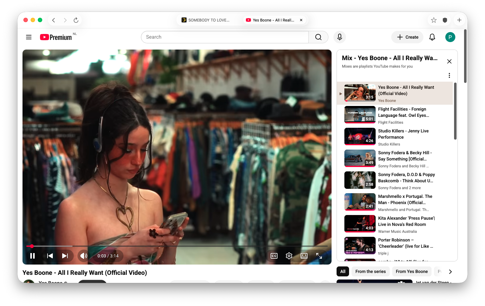

# Sonrisa

A lightweight Chromium-based browser for macOS (Apple Silicon), built with
SwiftUI and the [Chromium Embedded Framework](https://github.com/chromiumembedded/cef).



Tabs, tab groups, favorites, history, downloads, passwords, autofill, ad
blocking, incognito, DevTools, bookmark import, and configurable search
engines — in a ~330 MB app.

## Building

Requirements: macOS on Apple Silicon, Xcode, CMake.

```sh
git clone https://github.com/pieterhielkema/Sonrisa.git
cd Sonrisa
scripts/fetch_cef.sh          # downloads CEF binaries (~250 MB) + builds the wrapper
xcodebuild -project Sonrisa.xcodeproj -scheme Sonrisa -configuration Debug build
```

Or open `Sonrisa.xcodeproj` in Xcode and hit Run after `fetch_cef.sh`.

The CEF renderer helper is built by `scripts/embed_cef.sh` (runs as a build
phase; run it manually after editing `helper/helper_main.mm`).

## Video codecs (H.264/AAC)

Stock CEF builds ship without proprietary codecs, so mp4/H.264 video does not
play. `scripts/build_cef_codecs.sh` builds a codec-enabled framework from
Chromium source (6–12 h, ~100 GB temp disk); swap the resulting
`Chromium Embedded Framework.framework` into `third_party/cef/Release/`.

## License

Sonrisa's own code: see repository. CEF and Chromium are BSD-licensed.
